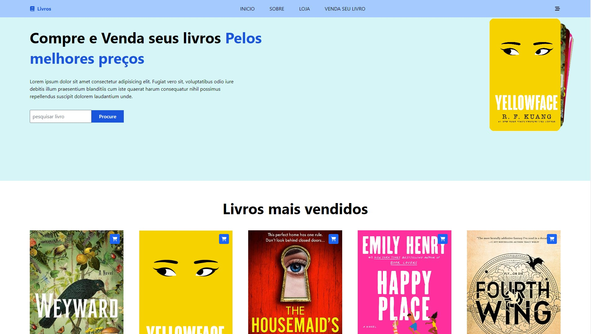
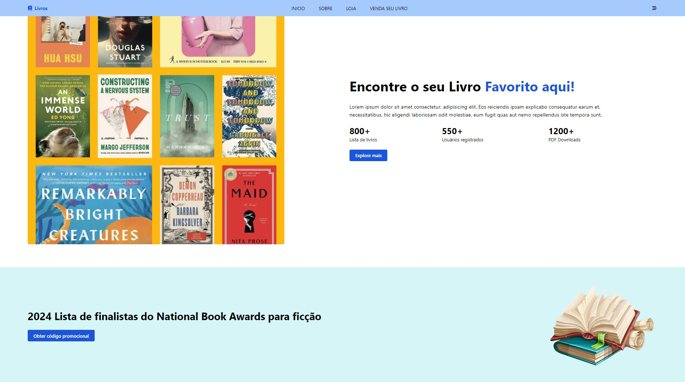
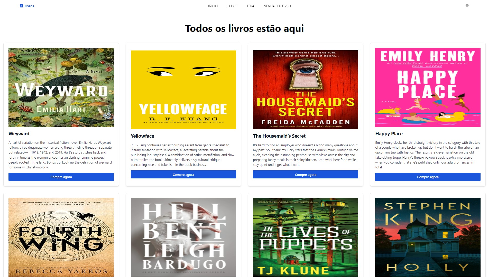
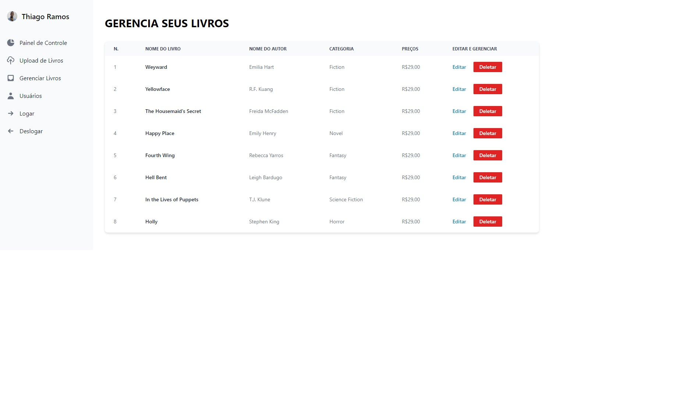

<h1 align="center" ><a href="https://mern-book-inventory-b3eeb.web.app/" target="_blank">Book Store</a></h1>

 

     

  

<h2 align="center">Projeto</h2>

Esta é uma aplicação web desenvolvida com React no frontend e ExpressJS, MongoDB e Postman no backend. No frontend, os usuários podem navegar pelos livros disponíveis, pesquisar por título, autor ou gênero e visualizar detalhes sobre cada livro.

No backend, o ExpressJS lida com as requisições HTTP, conectando-se ao banco de dados MongoDB para armazenar e recuperar informações sobre os livros, como título, autor, gênero e etc. Postman é usado para testar e documentar as APIs RESTful do backend, garantindo que elas estejam funcionando corretamente e sejam acessíveis para o frontend.

 

   

        

  

        

  

        

  

        

<h2>Tecnologias</h2>
<ul>
   <li>HTML</li>
   <li>CSS</li>
   <li>React</li>
   <li>ExpressJS</li>
   <li>MongoDB</li>
   <li>Postman</li>
</ul>
