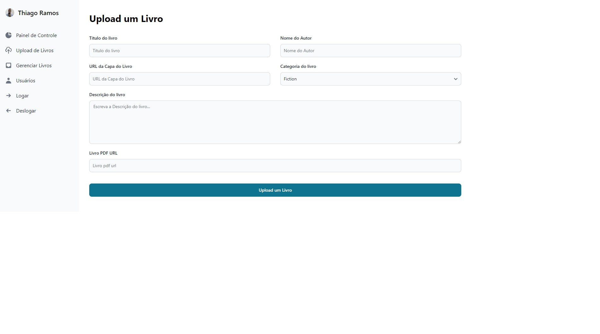

<h1 align="center" ><a href="https://thiagoramos-port.web.app" target="_blank">React Portfolio</a></h1>

 

     

  

<h2 align="center">Projeto</h2>

React Portfolio é um projeto que eu criei usando react com intuito de praticar substituindo o porfolio antigo.

 

   

        

  

        

  

        

  

        

<h2>Tecnologias</h2>
<ul>
   <li>HTML</li>
   <li>CSS</li>
   <li>React</li>
</ul>
